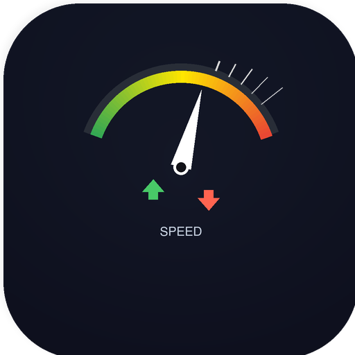

<picture>
  <source media="(prefers-color-scheme: dark)" srcset="https://img.shields.io/badge/Swift-5.9%2B-F05138?logo=swift&logoColor=white&style=flat-square">
  
</picture>


<br />

<p align="center">
  
</p>

<h1 align="center">⚡ Speed Tracker</h1>

<p align="center">
  <b>Monitor de red en tiempo real desde la barra de menú de macOS</b><br />
  Velocidad de subida, descarga, estadísticas de sesión y más, en un panel nativo elegante.
</p>

<p align="center">
  <i>Hecho en SwiftUI por <a href="https://github.com/betho1822">Alberto Guerrero</a></i>
</p>

<br />

---

## 📸 Vista previa

<!-- TODO: Agrega assets/screenshot.png con una captura real del panel abierto. -->

> ⏳ *Próximamente: captura real del panel.  
> Toma un screenshot con ⌘+⇧+4, guárdalo como `assets/screenshot.png` y actualiza esta sección.*

---

## ✨ Funcionalidades

- **Velocidad en tiempo real** — Subida y descarga actualizadas cada segundo.
- **Detección inteligente de interfaz** — Prioriza Wi-Fi/Ethernet sobre Tailscale/VPN.
- **Estadísticas de sesión** — Total subido/descargado y picos desde que abriste la app.
- **Indicador visual dinámico** — Brillo, color y etiqueta cambian según la velocidad:
  - 🔥 *¡Máxima!* — más de 10 Mbps
  - ⚡ *Rápido* — más de 5 Mbps
  - ✅ *Activo* — navegación normal
- **Panel elegante nativo** — Diseño con materiales, sombras y animaciones fluidas de SwiftUI.
- **Modo Dock opcional** — Muestra u oculta el icono del Dock desde el mismo panel.
- **Atajo a Ajustes de Red** — Abre las preferencias de red de macOS con un clic.
- **Binario universal** — Compatible con Apple Silicon y Mac Intel.

---

## 📦 Instalación

### Descarga directa

1. Descarga el DMG desde la sección [Releases](https://github.com/betho1822/SpeedTracker/releases).
2. Abre el DMG y arrastra **Speed Tracker** a la carpeta **Applications**.
3. Abre la app desde Launchpad o la carpeta Applications.

### Homebrew (Planeado)

Posiblemente en el futuro como tap, no disponible todavía.

---

## ⚠️ Aviso sobre app sin firmar

Speed Tracker no está firmado con un Apple Developer ID ($99/año), por lo que macOS mostrará una advertencia la primera vez que lo abras.

Para abrirla sin riesgos:

1. **Clic derecho** sobre `Speed Tracker.app` → **Abrir** → **Abrir**.
2. O ve a **System Settings > Privacy & Security** y busca el mensaje *"Speed Tracker was blocked"* → haz clic en **Open Anyway**.

Es una app de código abierto, completamente segura. Si prefieres, puedes [compilarla tú mismo](#-compilar-desde-código-fuente).

---

## 🔧 Compilar desde código fuente

**Requisitos:**

- macOS 13.0+ (Ventura o superior)
- Xcode 15.0+ (Swift 5.9+)

**Pasos:**

```bash
git clone https://github.com/betho1822/SpeedTracker.git
cd SpeedTracker
open "Speed Tracker.xcodeproj"
```

Presiona **Cmd+R** en Xcode para compilar y ejecutar.

O desde terminal:

```bash
xcodebuild -project "Speed Tracker.xcodeproj" \
           -scheme "Speed Tracker" \
           -configuration Release build
```

El `.app` compilado aparecerá en `Build/Products/Release/`.

---

## 🏗️ Arquitectura

```
SpeedTracker/
├── NetworkMonitorApp.swift   # Entry point, Scene, lógica de menubar
├── MenuBarView.swift         # Panel completo de la interfaz
├── NetworkMonitor.swift      # Lógica de red, muestreo de interfaces
└── Formatters.swift          # Formateo compacto de bytes/tasas
```

| Archivo | Propósito |
|---------|-----------|
| `NetworkMonitorApp.swift` | Define la escena `MenuBarExtra`, alterna política de activación (Dock/menubar). |
| `MenuBarView.swift` | Todo el UI del panel: tarjetas de velocidad, estadísticas, botones de acción, toggle del Dock. |
| `NetworkMonitor.swift` | Muestrea interfaces de red vía `getifaddrs()`, calcula diferencias byte/s, detecta interfaz activa. |
| `Formatters.swift` | Utilidades para mostrar bytes en formato legible (`1.2 MB/s`, `5.8 GB`). |

---

## ⚙️ Requisitos del sistema

| Requisito | Versión |
|-----------|---------|
| macOS | 13.0 Ventura o superior |
| Hardware | Apple Silicon o Intel |
| Xcode (para compilar) | 15.0+ (Swift 5.9+) |

---

## 👤 Autor

**Alberto Guerrero**

[](https://github.com/betho1822)

---

## 📄 Licencia

Distribuido bajo la licencia **MIT**.  
Ver el archivo [LICENSE](LICENSE) para más detalles.

---

## 🤝 Contribuir

¿Encontraste un bug o tienes una idea?

1. Abre un [Issue](https://github.com/betho1822/SpeedTracker/issues).
2. Haz un fork, crea una rama y envía un Pull Request.

Lee [CONTRIBUTING.md](CONTRIBUTING.md) para más detalles.  
Por favor, sé respetuoso y sigue el [Código de Conducta](CODE_OF_CONDUCT.md).

---

## 📋 Changelog

Todas las versiones se documentan en [CHANGELOG.md](CHANGELOG.md).

---

<p align="center">
  <sub>Hecho en Querétaro, México 🇲🇽</sub>
</p>
